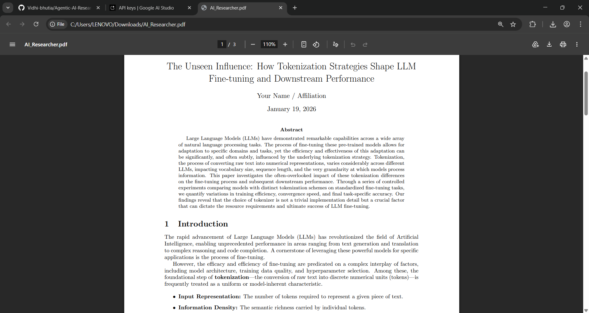

# Agentic AI Researcher

Agentic AI Researcher is an **agentic AI automation project** that demonstrates how autonomous agents can search, read, reason over academic literature, and generate structured research-style documents.

> **Important Note**
> This project is built **for demonstration, learning, and prototyping purposes only**. It should **not be used for actual academic publishing** without thorough human review, validation of citations, and originality checks.

## What This Project Demonstrates

* Agentic AI workflows (planning → tool usage → synthesis)
* Automated literature discovery using arXiv
* PDF reading and content extraction
* Structured research-style document generation
* LaTeX-based PDF creation

This project is ideal for:

* Understanding agentic AI systems
* AI research tooling demos
* Hackathons, portfolios, and interviews

## Example Output

Below is an example of a generated research document produced by the system:



The example folder also contains the generated LaTeX (`.tex`) and compiled PDF files.

## Project Structure

```
Agentic-AI-Researcher/
│
├── app.py                  # Streamlit application
├── ai_agent.py             # Core agent logic and orchestration
├── tools/
│   ├── arxiv_tool.py       # arXiv paper search
│   ├── read_pdf.py         # PDF text extraction
│   └── write_pdf.py        # LaTeX + PDF generation
│
├── Example of Generated Doc/
│   ├── image.png           # Sample output preview
│   ├── AI_Researcher.pdf   # Generated research paper
│   └── paper_*.tex         # LaTeX source
│
├── pyproject.toml          # Project dependencies
├── uv.lock                 # Dependency lock file
└── README.md
```

## Setup Instructions (Detailed)

### 1. Python Version

Ensure you are using **Python 3.10 or above**.

You can check your version with:

```bash
python --version
```

### 2. Install `uv` (Dependency Manager)

This project uses **uv** for fast and reproducible dependency management.

Install uv:

```bash
pip install uv
```

Verify installation:

```bash
uv --version
```

### 3. Sync Project Dependencies

From the project root directory:

```bash
uv sync
```

This will:

* Read dependencies from `pyproject.toml`
* Use `uv.lock` for deterministic installs
* Create an isolated environment automatically

### 4. Set Up Gemini API Key

This project uses **Google Gemini** for agent reasoning and content generation.

#### Steps:

1. Go to **Google AI Studio**
2. Create an API key
3. Set the key as an environment variable 

**Windows (PowerShell):**

```powershell
setx GEMINI_API_KEY "your_api_key_here"
```

**Linux / macOS:**

```bash
export GEMINI_API_KEY="your_api_key_here"
```

Restart your terminal after setting the key.

### 5. Install LaTeX Engine (Tectonic)

PDF generation requires a LaTeX engine. This project works best with **Tectonic**.

#### Windows

Run PowerShell as Administrator:

```powershell
[System.Net.ServicePointManager]::SecurityProtocol = [System.Net.ServicePointManager]::SecurityProtocol -bor 3072
iex ((New-Object System.Net.WebClient).DownloadString('https://drop-ps1.fullyjustified.net'))
```

Verify installation:

```bash
tectonic --version
```

#### macOS

```bash
brew install tectonic
```

#### Linux

```bash
cargo install tectonic
```

### 6. Run the Application

Start the Streamlit app:

```bash
uv run streamlit run app.py
```

Open the local URL shown in the terminal to access the UI.

## How the Agentic Workflow Operates

1. User provides a research prompt
2. Agent plans the required steps
3. arXiv papers are searched and downloaded
4. PDFs are read and summarized
5. Information is synthesized into sections
6. LaTeX is generated and compiled into a PDF

All steps are handled autonomously by the agent.

## Usage Disclaimer

* This system **does not guarantee factual correctness**
* Citations may be incomplete or inaccurate
* Generated text may resemble source material

**Always treat outputs as drafts.**
Human validation is mandatory before any real-world use.

## Future Enhancements

* Multi-agent collaboration (planner, writer, reviewer)
* Citation validation and cross-checking
* Support for additional academic databases
* Editable section-wise output in UI

